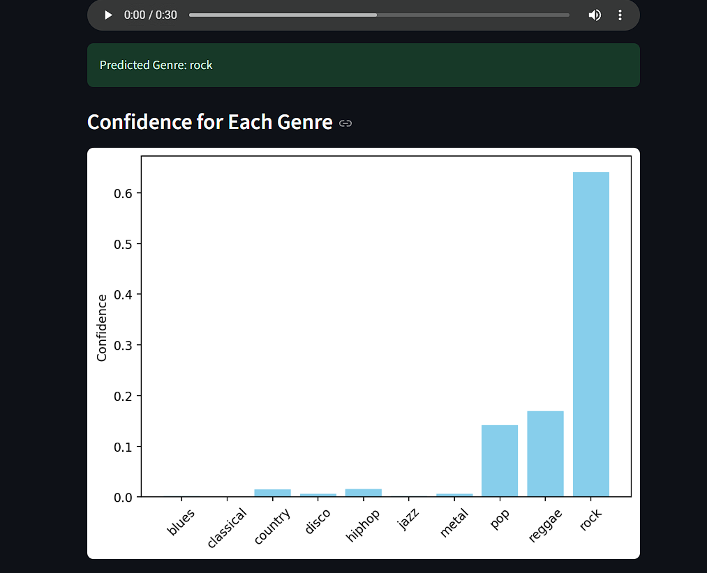
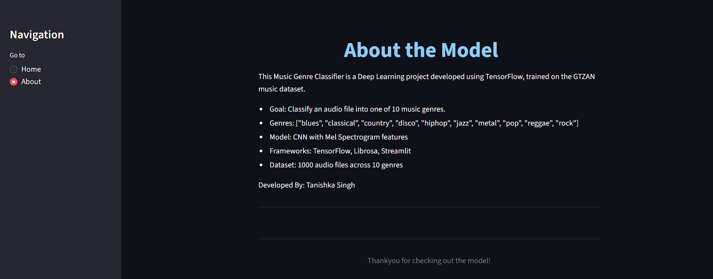

# Music Genre Classifier

An interactive deep learning web application that classifies music genres from audio files. Using Mel-Spectrograms and a Convolutional Neural Network (CNN), the model accurately predicts the genre of .wav files. The project is built with TensorFlow, trained on the GTZAN dataset, and deployed using Streamlit.

---

# Preview

## Live App :
[Click here to try it out](https://music-genre-classifier-ef5ddonmdndiuegbpsj7xn.streamlit.app/)

## Screenshots :

---

# Features

- Upload and analyze .wav music files
- CNN model trained on Mel-Spectrograms
- Real-time predictions with confidence scores
- Easy-to-use Streamlit interface

---

# Tech Stack

- Python
- TensorFlow / Keras
- Librosa
- Scikit-learn
- NumPy / Matplotlib
- Streamlit

---

# Model Architecture

- 5 Convolutional blocks with increasing filters
- ReLU activation and MaxPooling
- Dropout layers to prevent overfitting
- Fully connected dense layers
- Softmax output for 10 genres

---

# Model Performance

| Metric               | Value           |
|----------------------|-----------------|
| *Training Accuracy*| 93.66%          |
| *Validation Accuracy* | 93.65%      |
| *Training Loss*    | 0.2130          |
| *Validation Loss*  | 0.2131          |

The model generalizes well with *no overfitting* observed.

---

# Setup Instructions

1. *Clone the repository*
   
   git clone : https://github.com/TanishkaSingh100/Music-Genre-Classifier

2. *Install dependencies* :
   Make sure you're using Python 3.10

   pip install -r requirements.txt

3. *Download model weights* :
   The model will be auto-downloaded from Google Drive on the first run.

4. *Run the app*

    streamlit run app.py

---

 # Deployment Status
 Currently working on deployment via Hugging Face Spaces.
Will update the live demo link soon!

---

 # Inspiration
 Inspired by SPOTLESS TECH's youtube tutorial and extended with personal touches.

---

 # Author

Tanishka Singh
