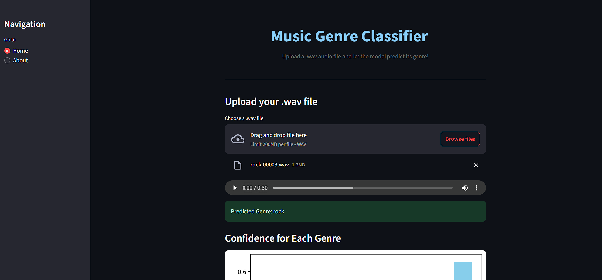
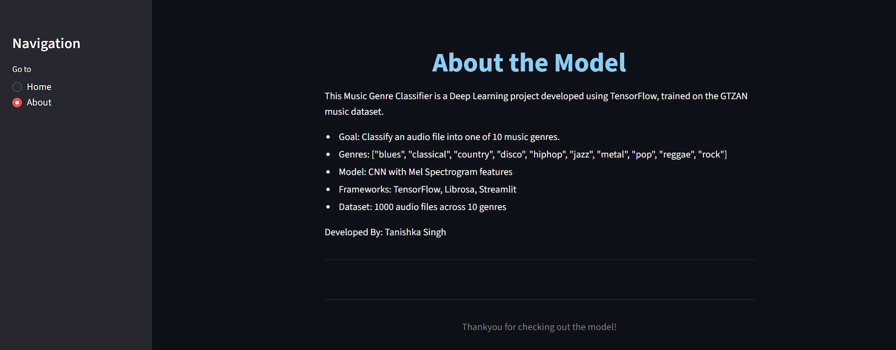
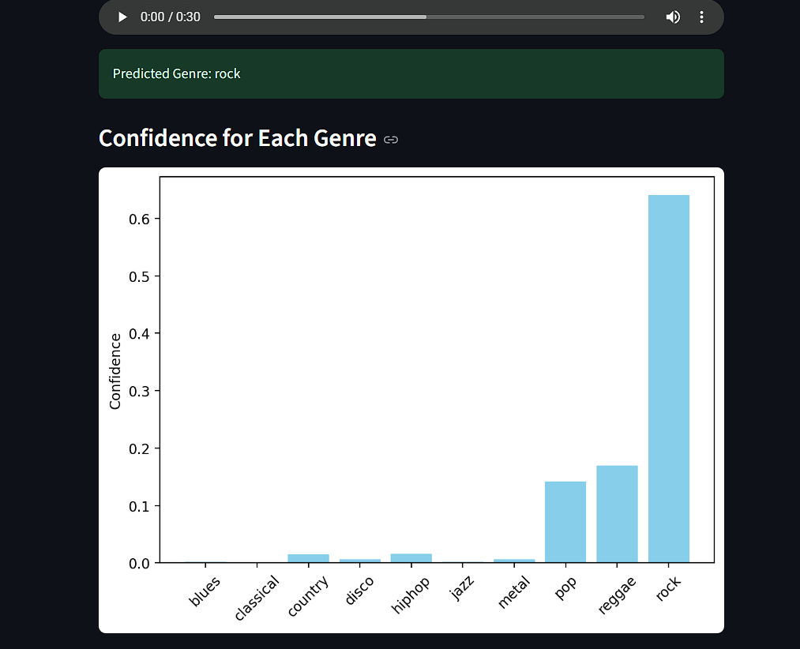

# Music Genre Classifier

An interactive deep learning web application that classifies music genres from audio files. Using Mel-Spectrograms and a Convolutional Neural Network (CNN), the model predicts the genre of .wav and .mp3 files.
Built with TensorFlow and Streamlit, trained on GTZAN dataset, and deployed on Streamlit Cloud.

---
# Preview

## Demo : [Click here to try it out](https://music-genre-classifier-ef5ddonmdndiuegbpsj7xn.streamlit.app/)

## Home Page :

## About Page :

## Confidence bar :

---

# Features

- Upload and analyze .wav or .mp3 music files
- CNN model trained on Mel-Spectrograms
- Real-time predictions with confidence scores
- User-friendly Streamlit web interface
- Automatically downloads the trained model on first run
---

# Tech Stack

- Python 3.10
- TensorFlow / Keras
- Librosa
- Pydub and FFmpeg (for .mp3 support)
- Scikit-learn
- NumPy / Matplotlib
- Streamlit

---

# Model Architecture

- 5 Convolutional blocks with increasing filters
- ReLU activation and MaxPooling
- Dropout layers to prevent overfitting
- Fully connected dense layers
- Softmax output layer for 10 music genres

---

# Supported Genres

  Blues, Classical, Country, Disco, Hiphop, Jazz, Metal, Pop, Reggae, Rock

---

# Model Performance

| Metric               | Value           |
|----------------------|-----------------|
| *Training Accuracy*| 93.66%          |
| *Validation Accuracy* | 93.65%      |
| *Training Loss*    | 0.2130          |
| *Validation Loss*  | 0.2131          |

The model generalizes well with *no overfitting* observed.

---

# Setup Instructions

1. *Clone the repository*
   
   git clone : https://github.com/TanishkaSingh100/Music-Genre-Classifier

2. *Install dependencies* :

   Make sure you're using Python 3.10

   pip install -r requirements.txt

3. *Install FFmpeg* :

   FFmpeg is required for .mp3 file support.

   - Download FFmpeg from https://ffmpeg.org/download.html

   - Extract it and add its /bin folder to your system PATH

   - Confirm installation:
     
      ffmpeg -version

      ffprobe -version

4. *Run the app*

   The model weights will be downloaded from Google Drive on the first run.

   streamlit run app.py

---

 # Deployment

   - Deployed on Streamlit Cloud

   - Works with both .wav and .mp3 formats

   - No need to set ffmpeg path manually - just make sure FFmpeg is in the system PATH

---

 # Inspiration

   Inspired by SPOTLESS TECH's youtube tutorial and extended with:
   
   - .mp3 file support

   - Improved error handling

   - Cleaner user experience

---

 # Author

   Tanishka Singh